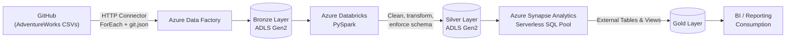

# Azure Medallion Lakehouse — AdventureWorks

An end-to-end Medallion Lakehouse (Bronze → Silver → Gold) built on Azure, ingesting the AdventureWorks dataset directly from GitHub and processing it through Azure Data Factory, Azure Databricks, and Azure Synapse Analytics.

## Overview

This project implements a production-style medallion architecture to practice and demonstrate core Azure data engineering skills: dynamic, parameterized data ingestion, distributed data processing with PySpark, secure credential management, and serverless SQL-based data serving.

The source data is the AdventureWorks sample dataset (11 CSV files covering sales, customers, products, and related entities), pulled programmatically from GitHub rather than uploaded manually — so the ingestion layer is fully dynamic and metadata-driven.

## Architecture



## Medallion Layers

### 🥉 Bronze — Raw Ingestion
- Azure Data Factory pipeline using a **Lookup → ForEach** pattern
- A `git.json` config file drives dynamic iteration over all 11 AdventureWorks CSVs — adding a new source file means adding a row to the config, not touching the pipeline
- HTTP connector pulls raw files directly from `raw.githubusercontent.com`
- Landed as-is into ADLS Gen2 (`adfadvdataset` storage account), no transformation applied — Bronze is a faithful copy of the source

### 🥈 Silver — Cleaned & Transformed
- Processed on an Azure Databricks cluster (`ADB_AdvW-Proj`, Standard_D4pds_v6, single-node, auto-terminating to control cost)
- PySpark notebooks handle schema enforcement, type casting, deduplication, and cleaning
- Authenticates to ADLS Gen2 via OAuth service principal, with the client secret pulled from a **Databricks secret scope** (`adf-adv-scope`) rather than hardcoded in notebook code
- Output written back to ADLS Gen2 in the Silver zone

### 🥇 Gold — Business-Ready
- Served through **Azure Synapse Analytics** (Serverless SQL Pool)
- External tables and views defined directly over the Silver layer, so no data duplication or extra compute cost for the serving layer
- Structured for straightforward downstream BI/reporting consumption

## Tech Stack

| Layer | Technology |
|---|---|
| Orchestration / Ingestion | Azure Data Factory |
| Processing | Azure Databricks (PySpark) |
| Storage | Azure Data Lake Storage Gen2 |
| Serving | Azure Synapse Analytics (Serverless SQL) |
| Source Data | AdventureWorks (via GitHub, HTTP connector) |
| Security | Databricks Secret Scopes, OAuth 2.0 Service Principal |

## Repository Structure

```
├── adf/
│   └── pipelines/         # Exported ADF pipeline JSON (Lookup/ForEach ingestion)
├── notebooks/
│   ├── silver/            # PySpark notebooks: Bronze → Silver transformation
│   └── gold/              # (if applicable) any notebook-driven Gold prep
├── synapse/
│   └── sql/                # CREATE EXTERNAL TABLE / VIEW scripts for the Gold layer
├── docs/
│   └── architecture-diagram.png   # optional static version of the diagram above
└── README.md
```

## Security Practices

- No credentials are hardcoded in notebooks or pipeline definitions — secrets are retrieved at runtime via Databricks secret scopes
- Service principal client secrets are rotated periodically as a matter of practice
- Databricks workspace access is scoped intentionally (workspace Policy set to Unrestricted only where needed for cluster compute, rather than left over-permissioned)

## Setup / Reproduction

1. Deploy an ADLS Gen2 storage account and create `bronze`, `silver`, and `gold` containers/paths
2. Register an Azure AD App (service principal) with `Storage Blob Data Contributor` on the storage account; store its credentials in a Databricks secret scope
3. Deploy the ADF pipeline (`adf/pipelines/`), pointing the `git.json` lookup at the AdventureWorks CSV URLs and the sink at your Bronze path
4. Run the pipeline to land raw data in Bronze
5. Attach the notebooks in `notebooks/silver/` to a Databricks cluster and run to produce Silver
6. In Synapse Serverless SQL, run the scripts in `synapse/sql/` to create external tables/views over Silver, producing Gold

## Challenges & Lessons Learned

- **OAuth/service principal debugging** — worked through authentication failures between Databricks and ADLS Gen2, resolved by correctly scoping OAuth conf keys and moving secrets into a Databricks secret scope
- **Workspace compute policy** — cluster creation was silently blocked by the workspace's "Personal Compute" policy rather than a subscription quota issue; switching to "Unrestricted" resolved it. Useful reminder to check workspace-level policy before assuming it's a quota problem
- **Dynamic pipeline config** — debugged JSON syntax errors in `git.json` and corrected source URLs to use the proper `raw.githubusercontent.com` format for all 11 files
- **PySpark vs. pandas** — adapted from pandas' attribute-style access to PySpark's function-based transformation syntax

## Author

**Abhigya Anand**
Business Analyst → Azure Data Engineer transition
📧 aabhigya59@gmail.com
🔗 [GitHub](https://github.com/AABHI-ANAND)
